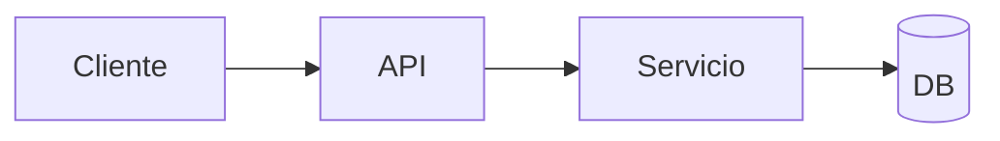

# Diseño: {nombre-feature}

> **Estado:** Borrador | En revisión | Aprobado
> **Slug:** `{feature-slug}`
> **Requisitos:** [requirements.md](./requirements.md)
> **Fecha:** {YYYY-MM-DD}

## 1. Resumen

{Un párrafo: enfoque técnico elegido y cómo satisface los requisitos.}

## 2. Arquitectura

{Descripción de alto nivel. Incluir diagrama si ayuda: mermaid o ascii.}



## 3. Componentes y responsabilidades

| Componente | Ubicación | Responsabilidad |
|------------|-----------|-----------------|
| {nombre} | `{ruta/archivo}` | {qué hace} |

## 4. Interfaces y contratos

### API / endpoints

| Método | Ruta | Request | Response | Errores |
|--------|------|---------|----------|---------|
| POST | `/api/...` | `{...}` | `{...}` | 400, 401, 500 |

### Tipos / schemas

```{lang}
// Definiciones clave
```

## 5. Modelo de datos

| Entidad | Campos | Relaciones |
|---------|--------|------------|
| {User} | id, email, ... | {1:N con Session} |

## 6. Flujos principales

### Flujo: {nombre}

1. {paso}
2. {paso}
3. {paso}

## 7. Manejo de errores

| Escenario | Comportamiento | Mensaje / código |
|-----------|----------------|------------------|
| {validación fallida} | {400 + detalle} | {INVALID_INPUT} |

## 8. Seguridad

- {autenticación, autorización, sanitización, secretos}

## 9. Testing

| Nivel | Qué se prueba | Herramienta |
|-------|---------------|-------------|
| Unit | {lógica X} | {jest/vitest/...} |
| Integration | {API Y} | {supertest/...} |
| E2E | {flujo Z} | {playwright/...} |

## 10. Decisiones de diseño (ADR lite)

| # | Decisión | Contexto | Consecuencias |
|---|----------|----------|---------------|
| D1 | {elegir X} | {por qué} | {trade-offs} |

## 11. Plan de migración / rollout

{Si aplica: feature flags, migraciones DB, rollback.}

## 12. Aprobación

- [ ] Revisado por usuario
- [ ] Listo para fase de tareas
